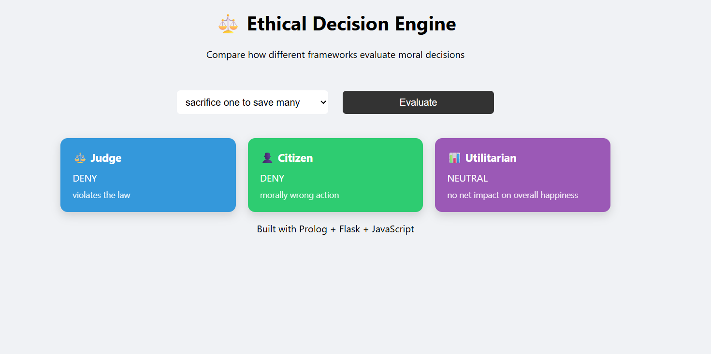

# Ethical Decision Engine

An explainable AI system that evaluates moral decisions using multiple ethical frameworks.

---

## Overview

This project simulates how different ethical perspectives judge the same action.  
It combines **symbolic AI (Prolog)** with a **web interface (Flask + JavaScript)** to provide transparent, multi-framework decision-making.

---

## Frameworks Implemented

- **Judge (Rule-Based)**
  - Follows laws and allows exceptions in extreme cases (e.g., saving a life)

- **Citizen (Moral Intuition)**
  - Based on common moral reasoning and human values

- **Utilitarian (Outcome-Based)**
  - Chooses actions that maximize overall happiness

---

## Features

- Multi-framework ethical evaluation
- Explainable outputs (decision + reasoning)
- Modular Prolog-based reasoning engine
- Interactive web interface
- Dynamic action selection
- Scalable knowledge base

---

## Tech Stack

- **Prolog (SWI-Prolog)** → reasoning engine  
- **Python (Flask)** → backend API  
- **HTML/CSS/JavaScript** → frontend UI  

---

## Project Structure
project/ 
│
├── app.py # Flask backend
├── main.pl # Prolog entry point
│
├── knowledge/
│ └── facts.pl # Actions, consequences, utilities
│
├── frameworks/
│ ├── judge.pl
│ ├── citizen.pl
│ └── utilitarian.pl
│
├── engine/
│ └── evaluator.pl # Dispatcher logic
│
├── config/
│ └── registry.pl # Registered actions & frameworks
│
├── templates/
│ └── index.html
│
├── static/
│ ├── style.css
│ └── script.js
│
└── requirements.txt

## How to Run

### 1. Install dependencies
pip install -r requirements.txt

### 2. Make sure SWI-Prolog is installed
Download: https://www.swi-prolog.org/

### 3. Run the Flask app
python app.py

### 4. Open in browser
http://127.0.0.1:5000/

## Example

### Action: sacrifice one to save many

## How It Works
User selects an action from the UI
Flask sends request to Prolog
Prolog evaluates using all frameworks
Results are parsed and returned as JSON
UI displays decisions with explanations

## Future Improvements
Add more ethical frameworks (Kantian ethics, virtue ethics)
Show utility scores in UI
Add real-world case studies
Improve natural language explanations
Deploy as a web app

## Contribution

Feel free to fork, improve, and experiment with new ethical scenarios.
